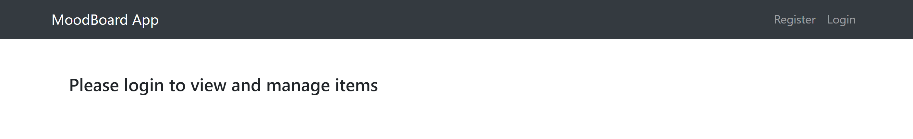
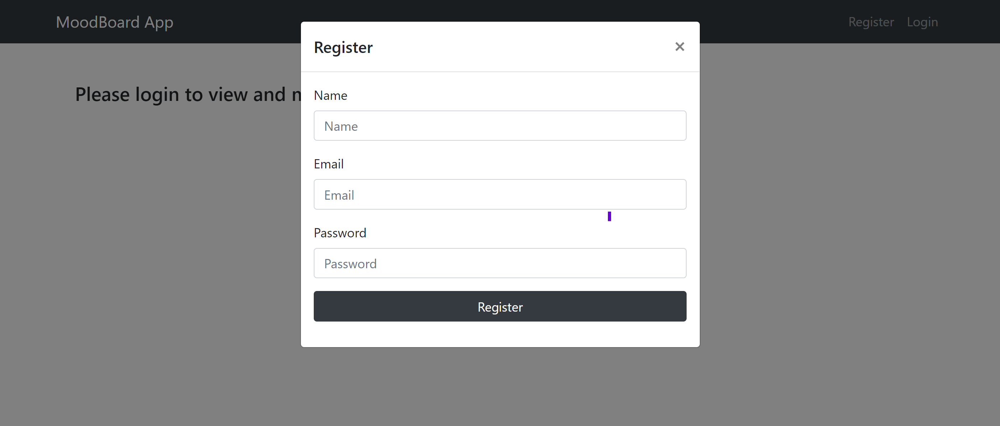
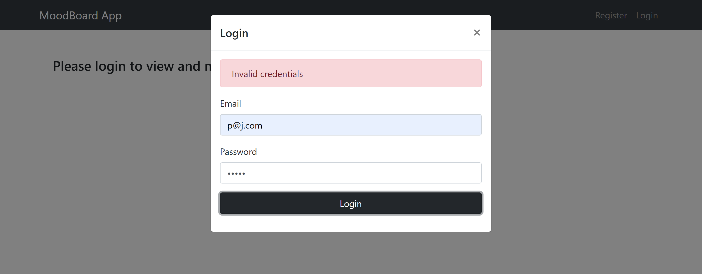
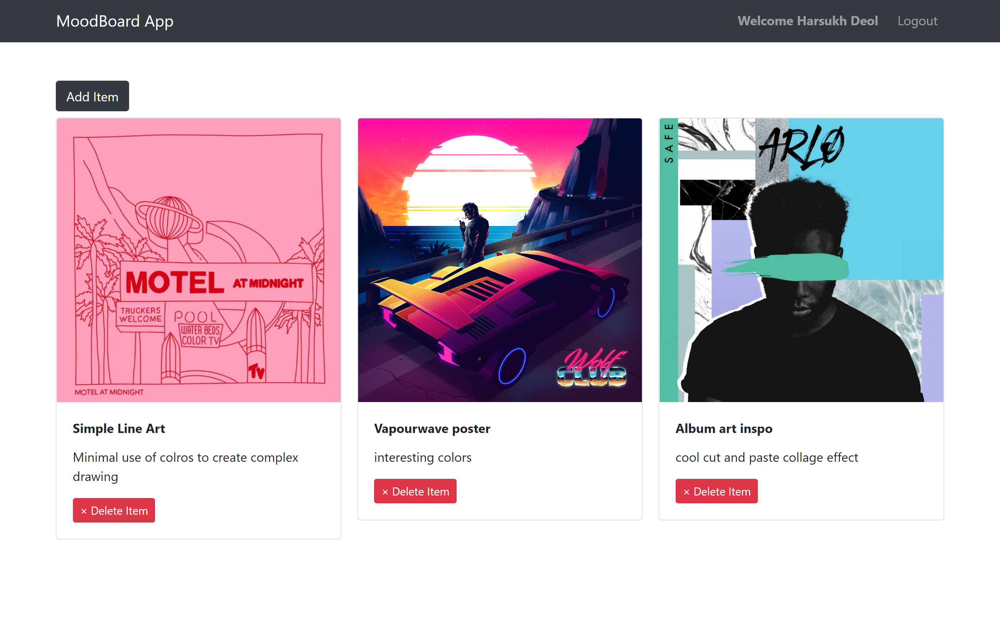
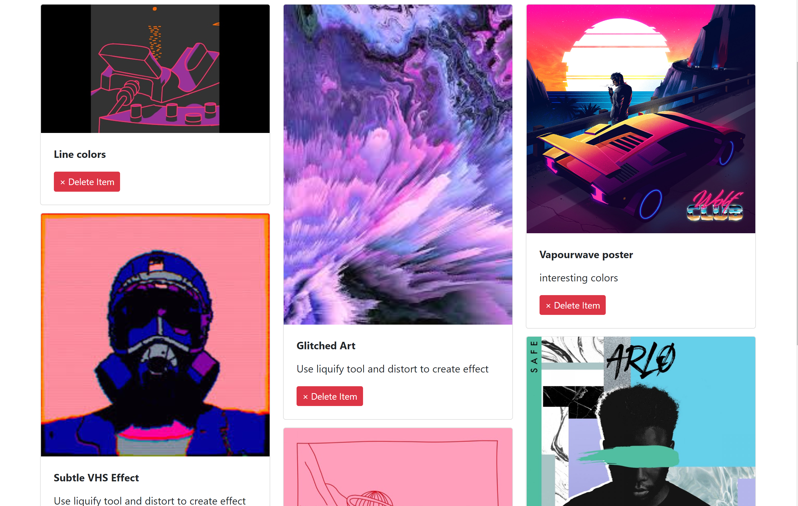
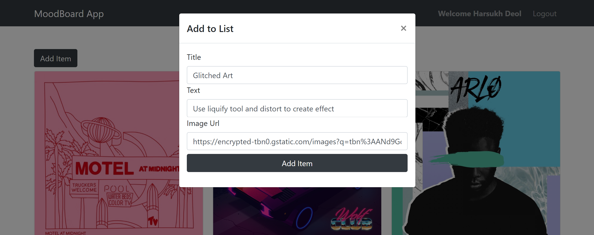

# moodboard

This app allows you to login at save ideas and notes into a moodboard!

Stack: Node.js, Express, React, Redux, MongoDB, Bootstrap components

## Homepage

This is how the app looks like when you first open it

## Register/Login

You can register a new account with a email and password, and use that to login.
Registration and Login components handle errors like user not found, invalid credentials, etc

## User Dashboard

Once you're logged in, it'll show you everything you've added before in a grid layout

## Add Item

You can add cards that contain titles, descriptions and images, or any combination of these. The only required field is the title and a card will render in the grid accordingly. 

